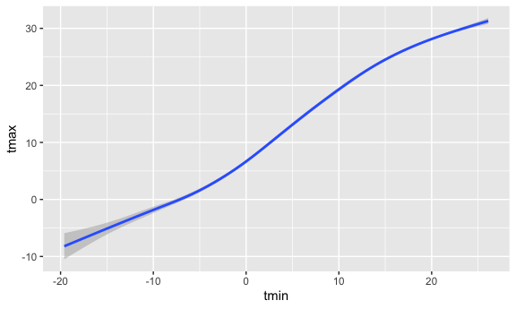
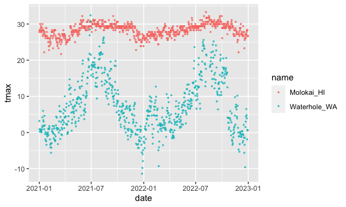
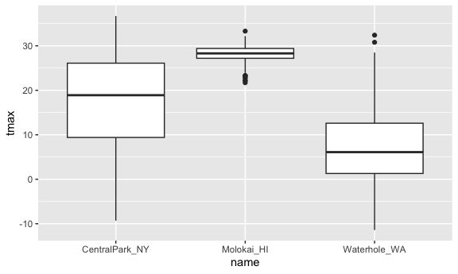

viz_part1
================
Luan Mengxiao
2023-09-28

``` r
library(tidyverse)
```

    ## ── Attaching core tidyverse packages ──────────────────────── tidyverse 2.0.0 ──
    ## ✔ dplyr     1.1.3     ✔ readr     2.1.4
    ## ✔ forcats   1.0.0     ✔ stringr   1.5.0
    ## ✔ ggplot2   3.4.3     ✔ tibble    3.2.1
    ## ✔ lubridate 1.9.2     ✔ tidyr     1.3.0
    ## ✔ purrr     1.0.2     
    ## ── Conflicts ────────────────────────────────────────── tidyverse_conflicts() ──
    ## ✖ dplyr::filter() masks stats::filter()
    ## ✖ dplyr::lag()    masks stats::lag()
    ## ℹ Use the conflicted package (<http://conflicted.r-lib.org/>) to force all conflicts to become errors

``` r
library(ggridges)

knitr::opts_chunk$set(
  fig.width = 6,
  fig.asp = .6,
  out.width = "90%"
)
```

Get the data ro be visualized from the Internet.

``` r
weather_df = 
  rnoaa::meteo_pull_monitors(
    c("USW00094728", "USW00022534", "USS0023B17S"),
    var = c("PRCP", "TMIN", "TMAX"), 
    date_min = "2021-01-01",
    date_max = "2022-12-31") |>
  mutate(
    name = recode(
      id, 
      USW00094728 = "CentralPark_NY", 
      USW00022534 = "Molokai_HI",
      USS0023B17S = "Waterhole_WA"),
    tmin = tmin / 10,
    tmax = tmax / 10) |>
  select(name, id, everything())
```

    ## using cached file: /Users/luanmengxiao/Library/Caches/org.R-project.R/R/rnoaa/noaa_ghcnd/USW00094728.dly

    ## date created (size, mb): 2023-09-28 10:20:23.237516 (8.524)

    ## file min/max dates: 1869-01-01 / 2023-09-30

    ## using cached file: /Users/luanmengxiao/Library/Caches/org.R-project.R/R/rnoaa/noaa_ghcnd/USW00022534.dly

    ## date created (size, mb): 2023-09-28 10:20:37.154539 (3.83)

    ## file min/max dates: 1949-10-01 / 2023-09-30

    ## using cached file: /Users/luanmengxiao/Library/Caches/org.R-project.R/R/rnoaa/noaa_ghcnd/USS0023B17S.dly

    ## date created (size, mb): 2023-09-28 10:20:42.028572 (0.994)

    ## file min/max dates: 1999-09-01 / 2023-09-30

Let’s make a plot.

``` r
ggplot(weather_df, aes(x = tmin, y = tmax)) + 
  geom_point()
```

    ## Warning: Removed 17 rows containing missing values (`geom_point()`).


pipes and stuff

``` r
weather_df |>
  filter(name == "CentralPark_NY") |>
  ggplot(aes(x = tmin, y = tmax)) + 
  geom_point()
```


``` r
ggplot_nyc_weather = 
  weather_df |>
  filter(name == "CentralPark_NY") |>
  ggplot(aes(x = tmin, y = tmax)) + 
  geom_point()

ggplot_nyc_weather
```


## Fancy plot

``` r
ggplot(weather_df, aes(x = tmin, y = tmax, color = name)) + 
  geom_point() +
  geom_smooth()
```

    ## `geom_smooth()` using method = 'loess' and formula = 'y ~ x'

    ## Warning: Removed 17 rows containing non-finite values (`stat_smooth()`).

    ## Warning: Removed 17 rows containing missing values (`geom_point()`).


``` r
ggplot(weather_df, aes(x = tmin, y = tmax)) + 
  geom_point(aes(color = name)) +
  geom_smooth()
```

    ## `geom_smooth()` using method = 'gam' and formula = 'y ~ s(x, bs = "cs")'

    ## Warning: Removed 17 rows containing non-finite values (`stat_smooth()`).
    ## Removed 17 rows containing missing values (`geom_point()`).


``` r
ggplot(weather_df, aes(x = tmin, y = tmax)) + 
  geom_smooth()
```

    ## `geom_smooth()` using method = 'gam' and formula = 'y ~ s(x, bs = "cs")'

    ## Warning: Removed 17 rows containing non-finite values (`stat_smooth()`).



``` r
ggplot(weather_df, aes(x = tmin, y = tmax, color = name)) + 
  geom_point() +
  geom_smooth(se = FALSE)
```

    ## `geom_smooth()` using method = 'loess' and formula = 'y ~ x'

    ## Warning: Removed 17 rows containing non-finite values (`stat_smooth()`).
    ## Removed 17 rows containing missing values (`geom_point()`).


``` r
ggplot(weather_df, aes(x = tmin, y = tmax)) + 
  geom_point(aes(color = name), alpha = 0.3) +
  geom_smooth(se = FALSE)
```

    ## `geom_smooth()` using method = 'gam' and formula = 'y ~ s(x, bs = "cs")'

    ## Warning: Removed 17 rows containing non-finite values (`stat_smooth()`).
    ## Removed 17 rows containing missing values (`geom_point()`).


Plot with facets

``` r
ggplot(weather_df, aes(x = tmin, y = tmax, color = name)) + 
  geom_point(alpha = .3) + 
  geom_smooth() + 
  facet_grid(. ~ name)
```

    ## `geom_smooth()` using method = 'loess' and formula = 'y ~ x'

    ## Warning: Removed 17 rows containing non-finite values (`stat_smooth()`).

    ## Warning: Removed 17 rows containing missing values (`geom_point()`).


``` r
ggplot(weather_df, aes(x = tmin, y = tmax, color = name)) + 
  geom_point(alpha = .3) + 
  geom_smooth() + 
  facet_grid(name ~ .)
```

    ## `geom_smooth()` using method = 'loess' and formula = 'y ~ x'

    ## Warning: Removed 17 rows containing non-finite values (`stat_smooth()`).
    ## Removed 17 rows containing missing values (`geom_point()`).


Let’s try a different plot.

``` r
ggplot(weather_df, aes(x = date, y = tmax, color = name)) + 
  geom_point(aes(size = prcp), alpha = .3) + 
  geom_smooth() + 
  facet_grid(. ~ name)
```

    ## `geom_smooth()` using method = 'loess' and formula = 'y ~ x'

    ## Warning: Removed 17 rows containing non-finite values (`stat_smooth()`).

    ## Warning: Removed 19 rows containing missing values (`geom_point()`).


try assigning a specific color

``` r
weather_df |>
  filter(name == "CentralPark_NY") |>
  ggplot(aes(x = date, y = tmax)) + 
  geom_point(color = "blue")
```


``` r
weather_df |>
  filter(name != "CentralPark_NY") |>
  ggplot(aes(x = date, y = tmax, color = name)) + 
  geom_point(alpha = .7, size = .5)
```

    ## Warning: Removed 17 rows containing missing values (`geom_point()`).



``` r
weather_df |>
  ggplot(aes(x = tmin, y = tmax)) + 
  geom_hex()
```

    ## Warning: Removed 17 rows containing non-finite values (`stat_binhex()`).


``` r
weather_df |>
  filter(name == "Molokai_HI") |>
  ggplot(aes(x = date, y = tmax)) + 
  geom_line(alpha = .5) + 
  geom_point(size = .5)
```

    ## Warning: Removed 1 rows containing missing values (`geom_point()`).


## univariate plotting

histogram

``` r
ggplot(weather_df, aes(x = tmax)) + 
  geom_histogram()
```

    ## `stat_bin()` using `bins = 30`. Pick better value with `binwidth`.

    ## Warning: Removed 17 rows containing non-finite values (`stat_bin()`).


``` r
ggplot(weather_df, aes(x = tmax, fill = name)) + 
  geom_histogram()
```

    ## `stat_bin()` using `bins = 30`. Pick better value with `binwidth`.

    ## Warning: Removed 17 rows containing non-finite values (`stat_bin()`).


``` r
ggplot(weather_df, aes(x = tmax, fill = name)) + 
  geom_histogram(position = "dodge")
```

    ## `stat_bin()` using `bins = 30`. Pick better value with `binwidth`.

    ## Warning: Removed 17 rows containing non-finite values (`stat_bin()`).


density plot

``` r
ggplot(weather_df, aes(x = tmax, fill = name)) + 
  geom_density()
```

    ## Warning: Removed 17 rows containing non-finite values (`stat_density()`).


``` r
ggplot(weather_df, aes(x = tmax, fill = name)) + 
  geom_density(alpha = .3, adjust = 2)
```

    ## Warning: Removed 17 rows containing non-finite values (`stat_density()`).


using boxlots

``` r
ggplot(weather_df, aes(y = tmax, x = name)) + 
  geom_boxplot()
```

    ## Warning: Removed 17 rows containing non-finite values (`stat_boxplot()`).



violin plots

``` r
ggplot(weather_df, aes(y = tmax, x = name)) + 
  geom_violin()
```

    ## Warning: Removed 17 rows containing non-finite values (`stat_ydensity()`).


ridge plot

``` r
ggplot(weather_df, aes(x = tmax, y = name)) + 
  geom_density_ridges()
```

    ## Picking joint bandwidth of 1.54

    ## Warning: Removed 17 rows containing non-finite values
    ## (`stat_density_ridges()`).


## saving and embedding plots

``` r
ggplot_weather = 
  weather_df |>
  ggplot(aes(x = tmin, y = tmax)) + 
  geom_point()

ggplot_weather
```

    ## Warning: Removed 17 rows containing missing values (`geom_point()`).


``` r
ggsave("results/ggplot_weather.pdf", ggplot_weather)
```

    ## Saving 6 x 3.6 in image

    ## Warning: Removed 17 rows containing missing values (`geom_point()`).

``` r
ggplot_weather
```

    ## Warning: Removed 17 rows containing missing values (`geom_point()`).


